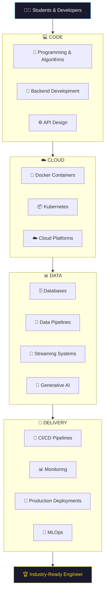

<div align="center">

<!-- Animated Banner / Logo Area -->


<!-- Tagline -->
### 💻 Code &nbsp;•&nbsp; ☁️ Cloud &nbsp;•&nbsp; 📊 Data &nbsp;•&nbsp; 🚀 Delivery &nbsp;•&nbsp; 🤖 MLOps &nbsp;•&nbsp; 🧠 GenAI

**Learn modern engineering by building real-world systems.**

<br/>

<!-- Badges Row 1 -->


<!-- Badges Row 2 -->


<br/>

</div>

---

## 📋 Table of Contents

<details>
<summary><b>Click to expand</b></summary>

- [🌍 What is C2D2Labs?](#-what-is-c2d2labs)
- [🧩 The C2D2 Framework](#-the-c2d2-framework)
  - [💻 Code](#-code)
  - [☁️ Cloud](#️-cloud)
  - [📊 Data](#-data)
  - [🚀 Delivery](#-delivery)
- [🗺️ Learning Roadmap](#️-c2d2-learning-roadmap)
- [🏗️ Architecture](#️-c2d2-architecture)
- [🧰 Tech Stack](#-tech-stack)
- [👨‍💻 Who Is This For?](#-who-is-this-for)
- [🤝 Contributing](#-contributing)
- [⭐ Support the Project](#-support-the-project)
- [🚀 Vision](#-vision)

</details>

---

## 🌍 What is C2D2Labs?

<div align="center">

> **C2D2Labs** is a community-driven learning lab where students and developers learn **modern software engineering and AI by building real-world systems.**

</div>

<table>
<tr>
<td width="50%">

### 🎯 What We Focus On

✅ Building **real-world** production projects  
✅ Understanding how **production systems** work  
✅ Learning **modern engineering tools**  
✅ Deploying to the **cloud** & shipping **AI systems**

</td>
<td width="50%">

### 🧠 Our Philosophy

```
Learn → Build → Deploy → Deliver → Optimize
  📖  →   🏗️  →   ☁️   →   🚀    →   🤖
```

Every concept is taught by **building something real** — not just reading theory.

</td>
</tr>
</table>

---

## 🧩 The C2D2 Framework

<div align="center">

The entire curriculum is organized around **four core pillars**:

| 💻 Code | ☁️ Cloud | 📊 Data | 🚀 Delivery |
|:---:|:---:|:---:|:---:|
| Software fundamentals | Real infrastructure | Stores & processes | Dev → Production |
| Algorithms, APIs, Architecture | Containers, K8s, IaC | Pipelines, AI/ML | CI/CD, MLOps, Monitoring |

</div>

---

### 💻 Code

> *Build strong software engineering fundamentals.*

<table>
<tr>
<td width="50%">

**📚 Topics Covered**

| Icon | Topic |
|------|-------|
| 🧠 | Algorithms & Problem Solving |
| 🧩 | Backend Development |
| ⚙️ | API Design & REST Principles |
| 🏛️ | Application Architecture Patterns |

</td>
<td width="50%">

**🛠️ Technologies**


</td>
</tr>
</table>

---

### ☁️ Cloud

> *Learn how applications run on real cloud infrastructure.*

<table>
<tr>
<td width="50%">

**📚 Topics Covered**

| Icon | Topic |
|------|-------|
| 🐳 | Containerization with Docker |
| 📦 | Kubernetes Orchestration |
| ☁️ | Cloud Platforms (AWS/GCP/Azure) |
| 🏗️ | Infrastructure as Code |

</td>
<td width="50%">

**🛠️ Technologies**


</td>
</tr>
</table>

---

### 📊 Data

> *Learn how systems store, process, analyze, and generate intelligence from data.*

<table>
<tr>
<td width="50%">

**📚 Topics Covered**

| Icon | Topic |
|------|-------|
| 🗄️ | Relational & NoSQL Databases |
| 🔄 | Data Pipelines & ETL |
| 📊 | Analytics & Visualization |
| 📈 | Business Insights at Scale |
| 🧠 | Generative AI Applications |

</td>
<td width="50%">

**🛠️ Technologies**


</td>
</tr>
</table>

---

### 🚀 Delivery

> *Learn how software moves from development to production — and stays healthy there.*

<table>
<tr>
<td width="50%">

**📚 Topics Covered**

| Icon | Topic |
|------|-------|
| 🔁 | CI/CD Pipelines |
| 🧪 | Automated Testing Strategies |
| 📡 | Monitoring & Observability |
| 🚀 | Production Deployments |
| 🤖 | MLOps: Model Deployment & Monitoring |

</td>
<td width="50%">

**🛠️ Technologies**


</td>
</tr>
</table>

---

## 🗺️ C2D2 Learning Roadmap

<div align="center">

```
┌──────────────────────────────────────────────────────┐
│                  🎓 START YOUR JOURNEY                │
└────────────────────────┬─────────────────────────────┘
                         │
                         ▼
┌──────────────────────────────────────────────────────┐
│  💻  STAGE 1 — CODE                                   │
│                                                      │
│  🔷 Programming Fundamentals                         │
│  🔷 Data Structures & Algorithms                     │
│  🔷 Backend Development                              │
│  🔷 REST API Design                                  │
└────────────────────────┬─────────────────────────────┘
                         │
                         ▼
┌──────────────────────────────────────────────────────┐
│  ☁️  STAGE 2 — CLOUD                                  │
│                                                      │
│  🔶 Docker & Containerization                        │
│  🔶 Kubernetes Orchestration                         │
│  🔶 AWS Cloud Platforms                              │
│  🔶 Infrastructure as Code (Terraform)               │
└────────────────────────┬─────────────────────────────┘
                         │
                         ▼
┌──────────────────────────────────────────────────────┐
│  📊  STAGE 3 — DATA                                   │
│                                                      │
│  🔵 Relational & NoSQL Databases                     │
│  🔵 Data Pipelines & Streaming (Kafka/Spark)         │
│  🔵 Analytics & Business Intelligence                │
│  🔵 Generative AI & LLM Applications                 │
└────────────────────────┬─────────────────────────────┘
                         │
                         ▼
┌──────────────────────────────────────────────────────┐
│  🚀  STAGE 4 — DELIVERY                               │
│                                                      │
│  🟣 CI/CD Pipelines & Automation                     │
│  🟣 Monitoring & Observability                       │
│  🟣 Production Deployments                           │
│  🟣 MLOps & Model Lifecycle Management               │
└────────────────────────┬─────────────────────────────┘
                         │
                         ▼
┌──────────────────────────────────────────────────────┐
│             🏆 INDUSTRY-READY ENGINEER                │
└──────────────────────────────────────────────────────┘
```

</div>

---

## 🏗️ C2D2 Architecture



---

## 🧰 Tech Stack

<div align="center">

**Languages & Frameworks**


**Cloud & Infrastructure**


**Data & AI**


**DevOps & Delivery**


</div>

---

## 👨‍💻 Who Is This For?

<div align="center">

| 👨‍🎓 CS Students | 🛠️ Self-Taught Devs | ☁️ Cloud Learners |
|:---:|:---:|:---:|
| Bridge the gap between theory and industry | Structure your learning around real projects | Hands-on Docker, K8s & AWS labs |

| 🔧 DevOps Beginners | 📊 Data Engineers | 🤖 AI/ML Enthusiasts |
|:---:|:---:|:---:|
| CI/CD, monitoring, and deployment workflows | Pipelines, Kafka, Spark, and analytics | GenAI, LLMs, MLOps and model serving |

</div>

---

## 🤝 Contributing

We welcome contributions from **students, developers, and mentors** at all levels!

<table>
<tr>
<td width="50%">

### 🙌 Ways to Contribute

- 📝 Add tutorials or learning guides  
- 🏗️ Create new hands-on projects  
- 📖 Improve existing documentation  
- 🐛 Fix bugs and open issues  
- 🔬 Build labs and exercises  
- 🌍 Translate content

</td>
<td width="50%">

### 📋 Steps to Contribute

```bash
# 1. Fork the repository
# 2. Clone your fork
git clone https://github.com/<your-username>/c2d2labs.git

# 3. Create a feature branch
git checkout -b feature/your-feature-name

# 4. Commit your changes
git commit -m "feat: add your feature"

# 5. Push and open a Pull Request
git push origin feature/your-feature-name
```

</td>
</tr>
</table>

> 📌 Please read our [CONTRIBUTING.md](./CONTRIBUTING.md) and follow the [Code of Conduct](./CODE_OF_CONDUCT.md).

---

## ⭐ Support the Project

<div align="center">

If C2D2Labs has helped you grow as an engineer, here's how you can give back:

| Action | Why it Matters |
|--------|---------------|
| ⭐ **Star** the repo | Helps others discover C2D2Labs |
| 🍴 **Fork** it | Build your own learning projects on top |
| 📢 **Share** it | Grow the community of learners |
| 🐛 **Open issues** | Help us improve content and labs |
| 💬 **Discuss** ideas | Shape the direction of the curriculum |

[](https://github.com/c2d2labs/c2d2labs/stargazers)

</div>

---

## 🚀 Vision

<div align="center">

> *"Build a community-driven engineering lab where developers learn by building real-world systems — spanning cloud, AI, MLOps, and GenAI applications."*
>
> **Our mission is simple: Help every student become an industry-ready engineer.**

<br/>

```
🌱 Learn by building.
🚀 Ship to production.
🤖 Optimize with AI.
🏆 Become industry-ready.
```

</div>

---

<div align="center">


**Made with ❤️ by the C2D2Labs Community**

[](https://github.com/c2d2labs/c2d2labs)

</div>
